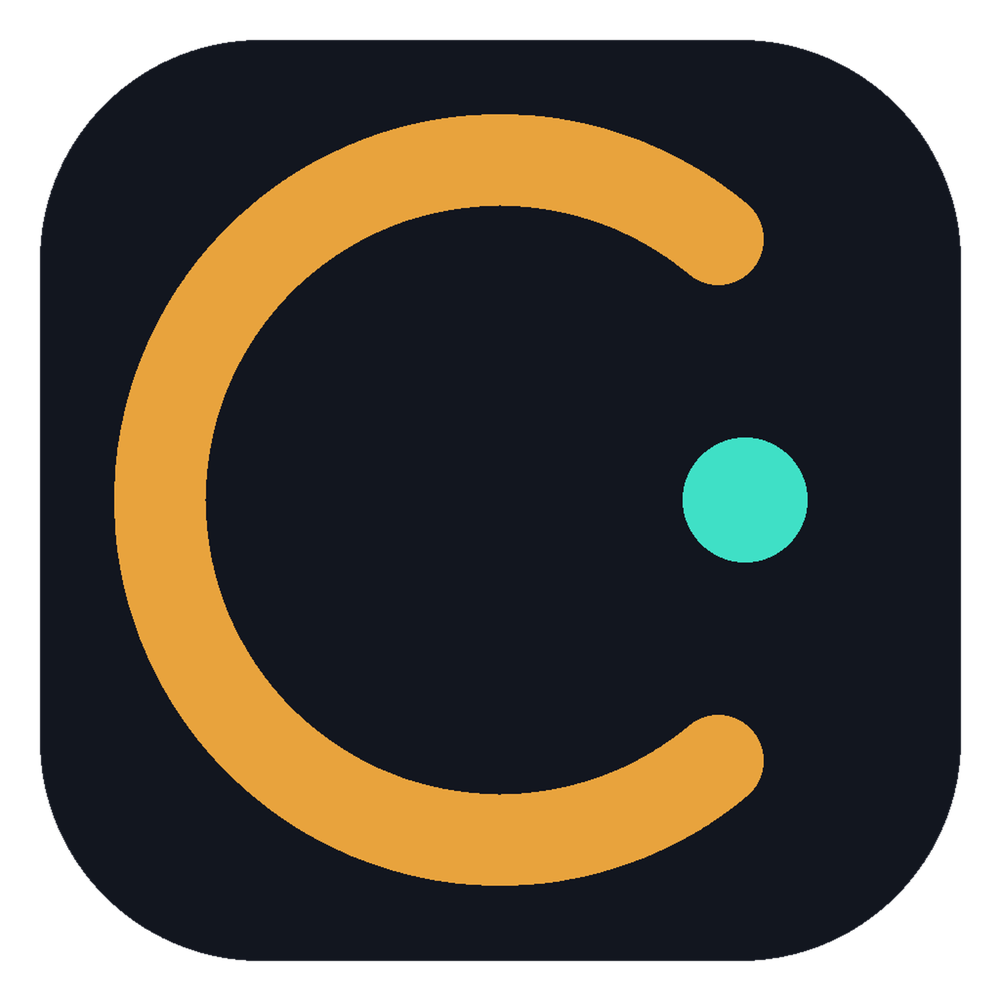

  

<h1 align="center">CutLabIA Studio</h1>

  <strong>El editor de video de escritorio gratuito que hace que tus videos se vean terminados — no "suficientemente buenos".</strong>

  
  
  

  <a href="README.md">English</a> ·
  <a href="README.pt-BR.md">Português (Brasil)</a> ·
  <a href="README.es.md"><strong>Español</strong></a>

  <a href="https://github.com/Velifag/Cut-Lab-IA-Studio">GitHub</a> ·
  <a href="https://github.com/Velifag/Cut-Lab-IA-Studio/releases/latest">Descargar</a> ·
  <a href="https://github.com/Velifag/Cut-Lab-IA-Studio/issues">Issues</a> ·
  <a href="LICENSE">Licencia</a>

CutLabIA Studio es un editor de video de escritorio — un fork de [Drift](https://github.com/CutWire-Studios/Drift)
de CutWire Studios, distribuido bajo la misma licencia GPL-3.0. Importa tus clips, agrega efectos,
subtítulos, stickers y música, y exporta un video con acabado profesional — **sin suscripción, sin
marca de agua y sin necesidad de cuenta**.

Está hecho para las ediciones que la gente realmente hace: Reels y Shorts, clips de videojuegos,
trabajos escolares, tutoriales, demostraciones de producto, memes y todo lo que quieras que se vea
bien sin vivir dentro de un navegador ni pagar una suscripción mensual.

Lo que ves en la vista previa es lo que exportas. Un solo compositor, un solo resultado, sin
sorpresas.

## Descargar

Descarga la versión para tu plataforma desde la
[última release](https://github.com/Velifag/Cut-Lab-IA-Studio/releases/latest):

| Plataforma | Paquete |
|----------|---------|
| Linux | [AppImage](https://github.com/Velifag/Cut-Lab-IA-Studio/releases/latest) |
| Windows | [Instalador (.exe)](https://github.com/Velifag/Cut-Lab-IA-Studio/releases/latest) · [Versión portátil (zip)](https://github.com/Velifag/Cut-Lab-IA-Studio/releases/latest) |
| macOS | [Imagen de disco (.dmg, Apple Silicon)](https://github.com/Velifag/Cut-Lab-IA-Studio/releases/latest) |
| Android | [APK (arm64-v8a)](https://github.com/Velifag/Cut-Lab-IA-Studio/releases/latest) · [APK (armeabi-v7a)](https://github.com/Velifag/Cut-Lab-IA-Studio/releases/latest) · [APK (x86_64)](https://github.com/Velifag/Cut-Lab-IA-Studio/releases/latest) |

En un teléfono, descarga `Drift-*-arm64-v8a.apk` desde la última release e instálalo (o usa
`adb install Drift-*-arm64-v8a.apk`). Usa la versión `x86_64` para emuladores.

Consulta [todas las releases](https://github.com/Velifag/Cut-Lab-IA-Studio/releases) para versiones
anteriores y changelogs completos.

<!-- Aún no distribuido en Flathub bajo este nombre — ese listado (org.cutwire.Drift) pertenece a
     CutWire Studios. Una publicación en Flathub para este fork necesitaría su propio app id y
     revisión. -->

## Capturas de pantalla

  

<em>Todo en una sola ventana — medios, vista previa, inspector y línea de tiempo</em>

  

<em>Una línea de tiempo multipista real, con superposiciones, títulos y miniaturas en tira de película</em>

<table>
  <tr>
    <td width="50%" align="center">
       
      <strong>Efectos que venden el look</strong> 
      Cada preset se previsualiza sobre un fotograma real
    </td>
    <td width="50%" align="center">
       
      <strong>Transiciones que se sienten caras</strong> 
      Colócala donde se superponen dos clips
    </td>
  </tr>
  <tr>
    <td width="50%" align="center">
       
      <strong>Stickers y emojis al instante</strong> 
      Busca, arrastra y suéltalos en el lienzo
    </td>
    <td width="50%" align="center">
       
      <strong>Títulos que realmente se ven</strong> 
      Neón, karaoke, resaltados y estilos de palabra llamativos
    </td>
  </tr>
  <tr>
    <td width="50%" align="center">
       
      <strong>Plantillas de look en un clic</strong> 
      Combos sincronizados con la música como Beat Drop y Glitch Cut
    </td>
    <td width="50%" align="center">
       
      <strong>Audio que suena intencional</strong> 
      EQ, compresor, gate, de-esser y herramientas de voz
    </td>
  </tr>
  <tr>
    <td width="50%" align="center">
       
      <strong>Velocidad, reversa y fundidos</strong> 
      Cámara lenta, rampas, reversa y entradas/salidas limpias
    </td>
    <td width="50%" align="center">
       
      <strong>Subtítulos generados a partir del propio audio</strong> 
      Genéralos y luego edita cada línea
    </td>
  </tr>
  <tr>
    <td width="50%" align="center">
       
      <strong>Haz clic en el sujeto. Quédate solo con eso.</strong> 
      Aísla a una persona u objeto en su propio clip
    </td>
    <td width="50%" align="center">
       
      <strong>Exportación igual a la vista previa</strong> 
      Presets simples a mano, control extra cuando lo quieras
    </td>
  </tr>
</table>

## Funciones que realmente aparecen en la edición

**Una línea de tiempo que se comporta como un editor de verdad.** Recorta, divide, ajusta (snap),
haz ripple, silencia u oculta pistas, y deshaz cualquier cosa. Apila superposiciones, títulos y
B-roll en lugar de pelear con un juguete de una sola pista.

**Looks en segundos, no en horas.** Efectos por GPU, transiciones con estilo y plantillas de look
reutilizables — para que un clip pase de material bruto a un resultado terminado sin abrir otra
aplicación.

**Texto, stickers, emojis y formas en el lienzo.** Títulos neón, subtítulos estilo karaoke, stickers
de reacción y llamadas de atención se quedan en el mismo editor que el corte.

**Subtítulos automáticos que realmente puedes corregir.** El habla se convierte en líneas de
subtítulo cronometradas. Edita el texto, ajusta el tiempo y exporta con subtítulos que coinciden con
cómo la gente ve videos en silencio.

**Recortes, máscaras y chroma key.** Haz clic en un sujeto y aíslalo en su propio clip. Enmascara
partes de una toma, o quita un fondo verde cuando necesites una composición más limpia.

**Movimiento que sigue el ritmo.** Rampas de velocidad, reversa, fundidos y cortes que encajan con
la música — el tipo de ritmo que hace que un clip se sienta diseñado, no improvisado.

**Herramientas de audio que limpian la mezcla.** Volumen, fundidos, EQ, compresión, limpieza de
ruido y efectos de voz, para que la narración y la música convivan en lugar de competir.

**Multicámara para cuando una cámara no es suficiente.** Mira todos los ángulos a la vez, cambia
entre cámaras y guarda el resultado como un corte limpio — sin reconstruir la línea de tiempo a
mano.

**Paquetes de proyecto para compartir y respaldar.** Empaqueta un proyecto con sus medios para que
toda la edición viaje contigo, en lugar de romperse en cuanto cambia una ruta de archivo.

**Exportación igual a la vista previa.** MP4 con presets de calidad, bucles GIF y exportación por
rango desde un área de trabajo de entrada/salida. Lo que aprobaste es lo que obtienes.

## Acceso de agente — deja que una IA edite contigo

CutLabIA Studio tiene un **servidor MCP** integrado para herramientas de IA locales. Activa el
acceso de agente y Cursor, Claude Code, u otro agente compatible puede trabajar en el proyecto
abierto: importar medios, colocar y recortar clips, cambiar efectos, capturar una imagen fija de la
composición y exportar.

Esto es un gancho de editor real, no un chatbot pegado a una página web. El agente ve la línea de
tiempo y puede hacer ediciones que puedes deshacer.

El acceso de agente permanece **desactivado hasta que lo actives**, y solo escucha en tu propia
computadora. La configuración completa y las notas de seguridad están en la
[guía de MCP](docs/MCP.md).

## Addons, sin inflar la instalación

Fuentes, stickers, efectos extra y modelos de transcripción de voz se descargan dentro de
CutLabIA Studio cuando los necesitas. Mantén la aplicación liviana y descarga solo los paquetes que
coincidan con el video que estás haciendo.

Abre el Gestor de Addons desde el encabezado, o sigue el aviso de instalación cuando una función
necesite un paquete.

## Por qué elegir CutLabIA Studio

La mayoría de los editores "gratuitos" quieren una cuenta, una marca de agua o una suscripción en
cuanto el video empieza a verse bien. CutLabIA Studio es lo contrario: **tuyo, en tu computadora,
GPLv3, sin muro de inicio de sesión.**

Es lo bastante rápido para un corte de redes sociales de 30 segundos y lo bastante completo para un
proyecto real — subtítulos, efectos, audio, recortes, multicámara y una línea de tiempo asistida por
IA si la quieres.

## Ayúdanos a traducir Drift

## Para desarrolladores

La compilación, el empaquetado, la arquitectura y el protocolo del agente están en `docs/`:

- [Compilación, pruebas, empaquetado y arquitectura](docs/BUILDING.md)
- [Efectos por GPU](docs/gpu-effects.md)
- [Transiciones por GPU](docs/gpu-transitions.md)
- [Arquitectura de Time Echo](docs/time-echo-architecture.md)
- [Acceso de agente / MCP](docs/MCP.md)

## Ayuda y comentarios

¿Encontraste un error o tienes una idea? Abre un
[issue en GitHub](https://github.com/Velifag/Cut-Lab-IA-Studio/issues).

## Licencia

GPLv3 — consulta [LICENSE](LICENSE).

## Historial de estrellas

<a href="https://www.star-history.com/?repos=Velifag%2FCut-Lab-IA-Studio&type=date&legend=top-left">
 <picture>
   <source media="(prefers-color-scheme: dark)" srcset="https://api.star-history.com/chart?repos=Velifag/Cut-Lab-IA-Studio&type=date&theme=dark&legend=top-left" />
   <source media="(prefers-color-scheme: light)" srcset="https://api.star-history.com/chart?repos=Velifag/Cut-Lab-IA-Studio&type=date&legend=top-left" />
   
 </picture>
</a>
